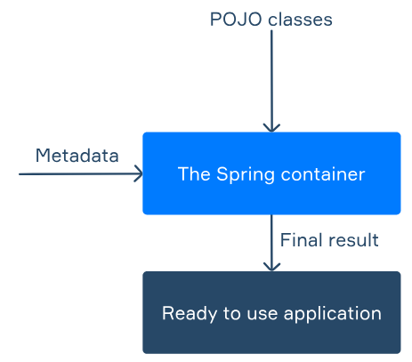

# IoC Container

**IoC**, which stands for **Inversion of Control**, is the mechanism used by Spring to implement 
dependency injection. When we create applications, we often need different objects to implement
various functionalities. Some objects will need to use other objects as their dependencies, which
may require other objects, and so on. To simplify this long and complex process, Spring uses
dependency injection.

Using the IoC process, objects can define the dependencies they need to run successfully. These 
dependencies are defined through constructor arguments, factory method arguments, or properties
set on the object instance. In this topic, we will overview the components of IoC and see how
they work together to create the dependency injection functionality.

## Spring container
When we need a ready-to-use Spring application, we need a few components to implement the
required functionality. The image below shows the typical structure of a Spring application.

Let's start by looking at the Spring container since it is the core of the Spring framework.
The Spring container manages the lifecycle of the application from start to finish. It manages 
various components created for the application and handles any required dependency injections.
The Spring container can be configured through metadata in several ways. Two types of metadata
are used in Spring: **XML** and **annotations**. The XML approach involves defining class-related
data in an external XML file, which can be loaded and used in the Spring application.

In our topics, we use the annotation-based approach, which is recommended for all new
Spring-based applications. The annotation-based approach involves adding annotations to simple
classes to provide context and functionality for Spring. These annotations start with the 
@ character and provide a specific value we wish to add to our class. These annotations allow us
to build objects with the required features and configurations. These objects are known as **POJO**
classes, and in the next section, we will see how they fit into the Spring framework.

## POJO

In the previous diagram, we saw that the Spring container takes in POJO classes. The term **POJO**
stands for **Plain Old Java Object**. A POJO is the most basic object type and contains no ties
to frameworks. This means that POJOs are valid objects for any application. The idea of a POJO
is that it is the simplest possible unit of code available for an application. POJOs can have
properties (and getters and setters for these properties) but cannot extend or implement 
framework-specific classes and interfaces or contain annotations.

The simplicity of POJOs makes them ideal building blocks for any application component we need to
implement. Besides POJOs, Spring can use a particular type of POJO called a **JavaBean**. With
**JavaBeans**, we add a few more requirements: for example, classes are required to be serializable.
In addition, they need private fields and a no-argument constructor. These classes can also be
customized and configured using Spring metadata. To do this, we can add various annotations to
them. For example, the @Bean annotation can be added to a factory method to define its return
value as a **Spring bean**, that is, an object managed by the IoC container. With these
annotations, it is possible to add any configurations to preexisting classes without creating 
additional files. This will allow you to take full advantage of the features provided by Spring.

To sum it all up:
- A POJO is a simple object that doesn't depend on a framework.
- A Java Bean is a POJO with some additional requirements and restrictions.
- A Spring Bean is a POJO or JavaBean created and managed by an instance of the Spring IoC
container.

## Contexts and bean factory

When we work with the Spring IoC container, there are two components we should be aware of. The
first one is the BeanFactory, an interface that allows for the configuration and management of
objects. The BeanFactory can produce container-managed objects known as beans, which can organize
the backbone of your application. These beans look like regular Java objects, but they can be
created during application startup, registered, and injected into different parts of the 
application by the container.

The second component is the ApplicationContext, a sub-interface of the BeanFactory. The
ApplicationContext aims to facilitate integration with Spring's Aspect Oriented Programming (AOP)
functionality. This functionality includes various components, ranging from message resource 
handling to application-layer-specific contexts. There are three main ApplicationContext 
implementations that we typically see in applications:
- FileSystemXmlApplicationContext
- ClassPathXmlApplicationContext
- WebApplicationContext

A FileSystemXmlApplicationContext will load bean definitions from an XML file that is provided
to the constructor through its full file path. This means that beans are initialized based on
the contents of a file from the application's file system. For a ClassPathXmlApplicationContext,
beans are still loaded from an XML file. However, the file is provided to the constructor as a
classpath property rather than a full file path. Finally, a WebApplicationContext is generally 
used to set the configuration of a web application in Spring. When using a WebApplicationContext,
you will often set the servlet configuration within a web.xml file. Inside this file, you can
specify configurations for each servlet that the application uses.

With our ApplicationContext, we can configure the Spring IoC container, allowing us to create
an application that is ready for use.

## Conclusion
 
The IoC container in Spring enables many important mechanisms required to create applications.
With the container, we can create ApplicationContext objects, which provide important 
configurations for the application setup. In addition, the container allows us to create POJOs,
such as Java beans, which can be used to create our own entities in the application. These
entities can help us bring life to our app and achieve the required functionality in the best
possible way. In subsequent topics, you will learn how to use IoC to create Spring Beans in
practice.
