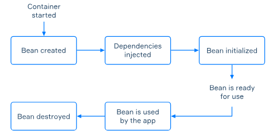

# Bean lifecycle

One of the primary responsibilities of the Spring Container is managing objects known as **beans**,
which form the backbone of any Spring application. Managing these objects is a complex process
consisting of multiple steps, and it uses a lot of internal concepts of the framework.

In this topic, we will dive into the lifecycle of beans and learn about some additional
functionalities the framework provides to customize this lifecycle. For simplicity, we will focus
only on the essential parts of the lifecycle because learning them all at once might be too
overwhelming for a single topic.

## A high-level overview of the bean lifecycle

As you know, when a Spring application is launched, the Spring Container gets started. The
container is mainly responsible for managing the **lifecycle** of beans from their creation
to destruction. The following picture gives us a high-level overview of this lifecycle.



As you can see, once the container has started, the lifecycle of a bean begins. The container
first creates a new bean object. Then, it injects the bean dependencies and performs some
additional initialization that a programmer can customize. After that, the bean is ready to be
used by the application. The lifecycle of a bean ends with its destruction when the container is
shut down.

> The presented lifecycle is the same for both @Bean-annotated methods and @Component-annotated
> classes. However, a significant difference exists between singletons and beans annotated with
> @Scope("prototype"). Spring doesn't destroy prototypes and doesn't allow us to customize their
> lifecycle.

Since any Spring application can contain multiple beans that depend on each other, the container
must create them in the right order according to their dependencies.

Note that separate parts of the bean lifecycle can be customized according to the specific
needs of a particular application. Bean initialization and destruction are especially worth 
considering because programmers often customize them. Other parts of the lifecycle can be
adjusted as well. However, that is required less often in practice.

## Customizing bean initialization and destruction

After dependency injection, some initialization might be required to get a bean into the
**ready state**. The Spring container performs this initialization automatically, but it also
allows us to customize the initialization according to the needs of our application. For example,
we can load resources, read a file, connect to a database, etc. At the same time, when a bean
is no longer required in the application, some custom cleanup may be necessary before destroying
the bean, such as closing some connections, cleaning files, and so on.

There are several ways to add these customizations to your code:
- Use special annotations (@PostConstruct, @PreDestroy, @Bean).
- Implement some interfaces (InitializingBean, DisposableBean).
- Use an XML bean definition file. (Since this is an outdated way mostly used for legacy 
applications, we will skip it in this topic.)

No matter your choice, you need separate methods for custom bean initialization and destruction.
These are the rules for such methods:
- The methods **can** have any names and access modifiers.
- The methods **must not** have any arguments. Otherwise, an exception will be thrown.

To demonstrate different ways of customizing beans, we will use a simple example with a library
of technical books comprising an in-memory list of strings. It should be enough for now to give
you the main idea.

## Using annotations for customization

The simplest way to customize the initialization and destruction of beans is to add the
@PostConstruct and @PreDestroy annotations to the methods of a container-managed class.

Here is an example with init and destroy methods annotated with @PostConstruct and @PreDestroy.
If we run an application containing this component, Spring will call the annotated methods only
once.
- Java
- Kotlin

Here is the output produced by the TechLibrary class:
```
The library has been initialized: [Clean Code, The Art of Computer Programming, Introduction to Algorithms]
2022-04-22 12:08:06.515  INFO Started HsSpringApplication in 0.382 seconds (JVM running for 5.698)
The library has been cleaned: []

Process finished with exit code 0
```

If you work with a @Bean-annotated method instead of a component, you can achieve the same result.
You need to specify the names of the init and destroy methods as the values of the initMethod
and destroyMethod properties of the @Bean annotation.

The following code is equivalent to the one above, but this new version uses @Bean instead of
@Component.
- Java
- Kotlin

If you run this code, the result will be the same as before.

We can also add the @PostConstruct and @PreDestroy annotations to the init and destroy methods
instead of specifying the attributes of the @Bean annotation, even if we use a @Bean-annotated
method.

## Using interfaces for customization

Another way to customize the initialization and destruction of beans is to implement the 
InitializingBean and DisposableBean interfaces and override their afterPropertiesSet and 
destroy methods.

Here is the modified version of the previous example:
- Java
- Kotlin

After running this code, the result will be the same as with the annotations.

## Post-processors for beans

Now that we've considered a few ways of initializing individual beans let's look at another
more straightforward way to target all beans. You can customize beans using the BeanPostProcessor
interface. Using the post-processor, we can run custom operations before or after beans are
initialized and even return modified beans.

To start using post-processors, your class should:
1. Implement the BeanPostProcessor interface.
2. Override the postProcessBeforeInitialization or postProcessAfterInitialization methods.

Here is an example of a post-processor that prints the name of processed beans:
- Java
- Kotlin

If you run this code, you will see a long list of beans in your application at different stages
of their lifecycle.

> Note that a BeanPostProcessor is executed for each bean defined in the Spring context,
> including the beans created by the framework. However, it is possible to keep beans from
> being modified using conditions.

Post-processors are an advanced concept. For now, it is enough to get their basic idea. Unlike
@PostConstruct, @PreDestroy, and other approaches for custom initialization, post-processors are 
used for processing multiple beans. The processors are usually not tied to business logic and
provide some infrastructure code that modifies or wraps the beans.

## Conclusion

In this topic, you've learned about the main stages of bean lifecycle management by the Spring
Container. You have also studied several ways to customize the initialization and destruction 
parts of the lifecycle: using the @PostConstruct and @PreDestroy annotations and with the
InitializingBean and DisposableBean interfaces. Finally, we've introduced the concept of a
post-processor that allows for modifying (all) new bean instances.

