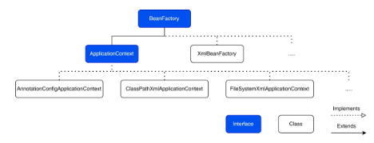

# Application context

The core concept of Spring is the **IoC (Inversion of Control) container**, which is responsible
for managing beans. The IoC container is an object that creates other objects (beans) and injects
dependencies in them. There are two primary interfaces that represent the IoC container:
BeanFactory and ApplicationContext. These interfaces have many implementations for different 
purposes. In this topic, we will take a closer look at ApplicationContext, and consider some
examples.

## BeanFactory & ApplicationContext

BeanFactory is a **root** interface for accessing the Spring IoC container. As for
ApplicationContext, it extends it. That is, ApplicationContext gets its basic functionality 
from BeanFactory and extends it with additional features. For example, ApplicationContext 
supports AOP integration, event publication, all types of bean scopes, and more. Since
ApplicationContext provides more functionality, it is advisable to use it instead of BeanFactory.

In this diagram, you can see some of the implementations of BeanFactory and ApplicationContext:



As you know, there are two ways to create metadata (bean definitions): by using an XML 
configuration file or annotations. ApplicationContext and BeanFactory objects are created 
based on metadata. That's why their implementations contain such words as "Xml" or "Annotation",
indicating the type of metadata.

The main difference between these interfaces is that BeanFactory doesn't support annotation-based
configuration, while ApplicationContext does. This fact gives a significant advantage to 
ApplicationContext over BeanFactory, because it's recommended to use annotation-based 
configuration for all new Spring applications.

## Creating an application context

Now let's create our own ApplicationContext based on annotation configuration.

Let's say we want to store objects of the Person type in our container. So, first of all, let's
create a Person class:
- Java
- Kotlin

An application context is created based on a configuration class, which means we need a
configuration class that describes what objects (beans) will be created inside the IoC container:
- Java
- Kotlin

We filled this configuration class with one bean definition (metadata), based on which a bean
will be created inside the container.

Here is what the above code "says" to our ApplicationContext:
1. Create a Person object with the property name set to Mary.
2. Call the created bean personMary.
3. Place the bean in the IoC container.

> @Configuration contains the @Component annotation inside, which also tells ApplicationContext 
> to create a bean based on the Config class. So, before creating the personMary bean,
> ApplicationContext also creates a config bean and places it in the IoC container.

Now it's time to create an application context based on the Config class and get all the bean
names (just their string names, not objects) from it.
- Java
- Kotlin

> If we were using XML configuration, we would create, for example, a
> ClassPathXmlApplicationContext object.

In the output, among several internal beans necessary for the Spring application, you can see
the names of our created beans: config and personMary.
```
[..., ..., config, personMary]
```
ApplicationContext overloads the getBean() methods inherited from BeanFactory:
- Java
- Kotlin

Let's get our Person bean (whole object) from the container by passing the Person class:
- Java
- Kotlin

If there are several beans of the same class in the container, you need to specify a unique
bean name in the getBean() method. Otherwise, an exception will be thrown.
- Java
- Kotlin

## @ComponentScan
Another way to create a bean is by using the @Component annotation placed above a class.

Let's create two @Component classes: Book and Movie:
- Java
- Kotlin

We aim to put these components into the same application context that is based on the Config
class. For the configuration class to know about the existence of the @Component classes, the
@ComponentScan annotation is used. We put this annotation above the configuration class name:
- Java
- Kotlin

By default, @ComponentScan scans all the classes in the current package and all its sub-packages,
looking for @Component classes (and all other annotations containing @Component, such as @Service,
@Configuration, and so on).

Now our context knows about the new beans: book and movie.
- Java
- Kotlin

You can change the default behavior of @ComponentScan and explicitly specify one or more base
packages for scanning:
- Java
- Kotlin

In @ComponentScan, the value attribute is defined as an alias of basePackages and vice versa.
Therefore, you can use them interchangeably. All these variants work in the same way:
- Java
- Kotlin

## ApplicationContext in Spring Boot

Usually, our class is the entry point of a Spring Boot application. Therefore, we annotate it
with the @SpringBootApplication annotation. Additionally, we run the application in the main
method.
- Java
- Kotlin

During the execution of the run method, an application context is created. We can get the
context and see what bean definitions it contains:
- Java
- Kotlin

In the output, you can see an array of the bean names used in the application. Even if we
didn't create our own beans, we see a lot of internal beans created by Spring Boot to keep
the application running.

@SpringBootApplication contains the @ComponentScan annotation, so our Spring Boot context
will know about our custom @Component (@Configuration, @Service, @Repository, and so on)
classes.

Another way to access the ApplicationContext is to use the @Autowired annotation. Just inject
the context created in the SpringApplication.run(...) method into another component. This
allows us to get the context anywhere in the application.

Let's get all bean names from ApplicationContext inside the Runner class:
- Java
- Kotlin

## Conclusion

In this topic, we learned about the ApplicationContext interface representing the core Spring
concept: the IoC container. It inherits from BeanFactory and has methods for managing beans in
the container. There are many implementations of ApplicationContext, for example,
AnnotationConfigApplicationContext for annotation-based configuration and 
ClassPathXmlApplicationContext for XML configuration. In Spring Boot, the
SpringApplication.run() method creates a context based on found beans, making our life much
easier!
