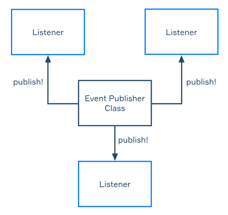

# Events and listeners

We are used to exchanging information between different parts of the application with the 
help of classes and their methods. But there is another way to do it. Today you'll learn 
about **events and listeners** ? one of the core technologies of Spring Framework.

## Events and listeners concept

In the Spring Framework, events and listeners are a way to implement event-driven architecture.
The idea is that when an event occurs in your application, you can notify any interested
listeners so that they can take action. Let's take a look at the diagram for a better
understanding of the concept of events and listeners:



In the diagram, one of the application classes publishes the events, and the other ones
"listen" if the event is published. If it happens, some code is executed. This approach
may grant some benefits: it makes the objects of your application less dependent on each
other. Also, it's very convenient to organize the communication between application parts 
in this way. Now let's understand how all these things work in Spring applications and 
how we can implement them.

## Events and listeners implementation

Let's create a simple example of a Spring Boot application that uses events and listeners.
First, we will implement the event itself. It is a simple class that may have its fields 
and methods. In the implementation we're considering now, this class must extend
ApplicationEvent. It is the abstract class made for event creation. It has one field in
which the source class of the event is kept. So, our implementation must have the
constructor in which the source of the event is passed to super():
```
public class HelloEvent extends ApplicationEvent {

    private final String message;

    public HelloEvent(Object source, String message) {
        super(source);
        this.message = message;
    }

    public String getMessage() {
        return message;
    }
}
```

The next step is to implement the listeners of this event. The implementation must be annotated
with @Component to be the ApplicationContext bean. The listener's classes implement the special
generic interface ApplicationListener that should be parameterized with the class of event we
listen to. Also, we need to override the method onApplicationEvent, with the help of which we
define what to do when the event is published. Let's create two listeners for HelloEvent to
understand the concept better:
```
@Component
public class HelloListenerOne implements ApplicationListener<HelloEvent> {

    @Override
    public void onApplicationEvent(HelloEvent event) {
        System.out.println("First listener handled the event, the message is " + event.getMessage());
    }
}

@Component
public class HelloListenerTwo implements ApplicationListener<HelloEvent> {

    @Override
    public void onApplicationEvent(HelloEvent event) {
        System.out.println("Second listener handled the event, the message is " + event.getMessage());;
    }
}
```

Now let's create a simple Spring Boot application in which we will use events and listeners:
```
@SpringBootApplication
public class EventsAndListenersProjectApplication {

    public static void main(String[] args) {
        SpringApplication.run(EventsAndListenersProjectApplication.class, args);
    }
}

@Component
class Runner implements CommandLineRunner {

    private final ApplicationEventPublisher eventPublisher;

    public Runner(ApplicationEventPublisher eventPublisher) {
        this.eventPublisher = eventPublisher;
    }

    @Override
    public void run(String... args) {
        HelloEvent event = new HelloEvent(this, "Hello World!");
        eventPublisher.publishEvent(event);
    }
}
```

If we want to have a class that can publish the events, we inject ApplicationEventPublisher 
into it. The code is very simple: we just create and publish the event. Note that we don't
need to interact with the listeners in the code: they will handle the event alone. Let's
launch the application and see its output:
```
First listener handled the event, the message is Hello World!
Second listener handled the event, the message is Hello World!
```
Everything works as expected: the event is published and then handled by the listeners.

## Synchronous approach
By default, handling events in Spring Framework is synchronous. The publisher method is
blocked until all registered listeners have processed the event. Let's see what it means
in the following example. We will change our listeners' event handling by adding thread
blocking to the onApplicationEvent method.
```
@Component
public class HelloListenerOne implements ApplicationListener<HelloEvent> {

    @Override
    public void onApplicationEvent(HelloEvent event) {
        System.out.println("First listener began to handle the event");
        try {
            Thread.sleep(500);
        } catch (InterruptedException e) {
            throw new RuntimeException(e);
        }
        System.out.println("First listener ended to handle the event");
    }
}

@Component
public class HelloListenerTwo implements ApplicationListener<HelloEvent> {

    @Override
    public void onApplicationEvent(HelloEvent event) {
        System.out.println("Second listener began to handle the event");
        try {
            Thread.sleep(500);
        } catch (InterruptedException e) {
            throw new RuntimeException(e);
        }
        System.out.println("Second listener ended to handle the event");
    }
}
```

We'll also update the application. We will publish two events and add thread blocking 
between these publications:
```
@Override
public void run(String... args) throws InterruptedException {
    System.out.println("The application was started");
    HelloEvent event = new HelloEvent(this, "Hello World!");
    eventPublisher.publishEvent(event);
    Thread.sleep(500);
    eventPublisher.publishEvent(event);
    System.out.println("The application was ended");
}
```

Take a look at the application output:
```
The application was started
First listener began to handle the event
First listener ended to handle the event
Second listener began to handle the event
Second listener ended to handle the event
First listener began to handle the event
First listener ended to handle the event
Second listener began to handle the event
Second listener ended to handle the event
The application was ended
```

As you can see, despite having added thread blocking, the event handling order is not disturbed.
The reason why it operates in this way is that the events' publication and the handling of them
are processed in the same thread.

## Annotation-driven listeners

There is a more convenient way to implement listeners in the Spring Framework. You can just
annotate the class methods with @EventListener, and these methods will handle the events.
Let's create such a class method for our HelloEvent handling:
```
@Component
public class AnnotationListener {
    @EventListener
    public void handleEvent(HelloEvent event) {
        System.out.println("The event occurred with the message " + event.getMessage());
    }
}
```

Now you can delete other listeners and check if this approach works as we expect it to with
the help of our very first application. Let's launch it and check the output:
```
The event occurred with the message Hello world!
```

Using this annotation-driven approach, you don't need to create special classes to implement
the events. A simple Java class also can be an event. Let's create this class:
```
public class PojoEvent {
}
```
Then we will implement the annotation-driven listener:
```
@Component
public class AnnotationListener {
    @EventListener
    public void handleEvent(PojoEvent event) {
        System.out.println("POJO event is being handled...");
    }
}
```

And now let's update our application and check how it works:
```
@Override
public void run(String... args) {
    eventPublisher.publishEvent(new PojoEvent());
}
```

Now launch the application and see the output:
```
POJO event is being handled...
```

The event is published and handled even if it was implemented as a simple Java class!

## Conclusion

Exchanging the information between the application modules with the help of events and
listeners is a very convenient feature. It is one of the core technologies of the Spring
Framework: many its features are implemented using events and listeners. Today you have
learned how to create and handle custom events in applications.
