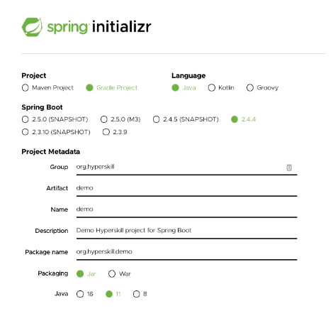

# Getting started with Spring Boot

In this topic, you will learn how to create your first Spring Boot application. This application is
quite simple and does nothing useful, but still, it will demonstrate the basic structure of any
Spring Boot project.

## Generating a Spring Boot application
It is often hard to start a new project from scratch, especially for beginners. You must set up the
basic structure, create configurations and manage all external dependencies. Fortunately, a website
called **Spring Initializr** can generate the basic Spring Boot project based on your wishes.



The site may look slightly different than the above image, but the general idea remains the same.
There are several essential options you need to specify before generating a project:
- The **build tool**: Maven or Gradle (with build scripts written in Groovy or the Kotlin DSL).
- The **JVM-based language**: Java (8, 11 or higher), Kotlin or Groovy.
- The **version of the Spring Boot framework** (e.g., the last released version without suffixes
like SNAPSHOT, M, etc.).
- **Project metadata** like group, artifact, description and package name.
- **External dependencies**: other frameworks and libraries.

In our example, we've chosen Gradle as the build tool and Java 11 as the language. You can select
a more recent version if you like. Our application is named *demo*.

By default, the packaging type for Spring Boot applications is **Jar**. This means that your
application will be packed in a *.jar* file that contains all the required dependencies. This
type of file is simpler to use than a *.war* file, which has to be deployed on an external 
application server.

After choosing the necessary settings and dependencies, click **Generate** to get an archive
with the project files. This archive contains the basic structure of a typical Spring Boot
application without any application logic. It is only a template that you'd have to fill with
logic yourself.

Another way to generate a Spring Boot application is to use an IDE like IntelliJ IDEA.

## Running the application

Although the generated application is useless for now, it is a good template to start with.

Let's run it! First, unpack the application and then visit the project directory. In our examples,
we will use Gradle as it is a commonly used build automation system.

First, we should build the application. In a Unix-like environment, use the following command.
```
./gradlew build
```
On Windows systems, execute the batch file using the command
```
gradlew build
```
This command uses the Gradle wrapper to create a .jar file and puts it in the
build/libs/ directory. Gradle automatically downloads all the necessary dependencies while 
building.

When finished building, Gradle should print a message like
```
BUILD SUCCESSFUL in 10s
```
Now, it is time to run the program contained in the .jar file.
```
java -jar build/libs/*.jar
```
If you get the message
```
no main manifest attribute, in build/libs/demo-0.0.1-SNAPSHOT-plain.jar
```
target the other .jar file by running
```
java -jar build/libs/demo-0.0.1-SNAPSHOT.jar
```
or run gradlew bootRun.

While running, this application prints the Spring logo and several log lines that we skipped.
```
.   ____          _            __ _ _
/\\ / ___'_ __ _ _(_)_ __  __ _ \ \ \ \
( ( )\___ | '_ | '_| | '_ \/ _` | \ \ \ \
\\/  ___)| |_)| | | | | || (_| |  ) ) ) )
'  |____| .__|_| |_|_| |_\__, | / / / /
=========|_|==============|___/=/_/_/_/
:: Spring Boot ::                (v2.4.4)
```
You may also build and start an application using a single line. In a Unix-like environment, you
can do so using the following command:
```
./gradlew build && java -jar build/libs/*.jar
```
Congratulations! You just created and started your first application using the Spring Boot 
framework without a single line of code except for a pair of commands.
