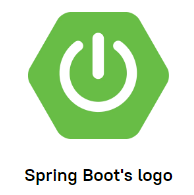

# Spring and Spring Boot frameworks

## The Spring Framework
**Spring** is one of the most popular application development frameworks for the Java Platform. First
of all, we use it to develop web applications, but we can also apply it to desktop applications and
even to command-line applications. In a way, Spring is a framework of frameworks that work together,
providing standard functionality to applications. That's why we sometimes call Spring a platform,
meaning it's more than just a framework.

Spring is huge, and it can do a lot of useful things. Here is a list of some parts of Spring
that provide services necessary to most real-world applications:
- A **component container** for managing the life cycle of objects inside an application.
- A **data access framework** for working with different types of databases.
- A **web framework** for building web applications with a web server.
- A **security framework** for supporting user authentication and authorization processes.
- A **testing framework** for writing tests for all parts of the application.

Despite its popularity and features, Spring is not a perfect framework, and its creators know that.
One of the main issues is that the configuration of Spring-based applications is very complex.
This slows down the development process and creates extra complexity for beginners.

Fortunately, the Spring developers realized it was possible to automate much of this work, so
they developed a new framework called **Spring Boot**. This framework solves many configuration 
problems and makes Spring one of the most successful and convenient web development platforms.

## What is Spring Boot?

**Spring Boot** is a part of the Spring platform that allows developers to create stand-alone
production-grade Spring-based applications that you can "just run."

This framework has greatly simplified the configuration of applications by applying the
**convention-over-configuration** approach. This means a programmer does not need to configure
everything. Instead, the framework defines default components, behavior, and automatic
configurations for each major use case of Spring. At the same time, when using Spring Boot,
you still have access to all the features of the Spring Framework, together with the acquired 
ease of development.

Spring Boot also provides a few additional cool features. Here are some of them:
- A command-line interface.
- Monitoring the status of your running applications (health/metrics),
- An embedded application server for running your application.

We hope you find these features interesting and will soon see all the simplicity and fun when
developing an application with Spring Boot! If you would like to read about the history and
philosophy of the Spring framework and Spring Boot, you can visit the official documentation and 
return to their application here.
