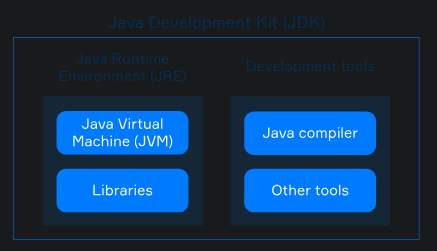

# Basic terms: JVM, JRE, JDK

JVM languages, such as Java, Kotlin, or Scala, may be confusing for beginners since there are a 
number of basic terms that might be hard to differentiate between at first. This topic will get
you more familiar with development for Java Platform by introducing those basics and giving an 
overview of how the code is being treated by different components of the platform.

## Java Virtual Machine (JVM)
The Java Virtual Machine, or JVM, is a virtual simulation of a physical computer. It executes the 
Java (or Java-compatible) bytecode, which comes after the source code compilation. In some sense, 
JVM acts as a mediator between the code and the real machine. It operates with a set of unified 
bytecode instructions that are interpreted and translated into machine instructions.

JVMs are available for many hardware and software platforms, so you can run the bytecode almost 
everywhere. A program compiled to bytecode is almost always platform-independent. Basically, when
you have a JVM language code, you need to compile it only once, get the bytecode, and you'll be 
able to run it on any platform that has JVM.

Today there is a variety of JVM implementations, Java HotSpot Virtual Machine being the primary 
reference.

## Java Runtime Environment (JRE)
Java Runtime Environment, or JRE, is an execution environment. It includes the necessary components
for running compiled JVM programs: the JVM itself and the Java Class Library (JCL).

JCL is essentially a set of standard libraries providing the most common functionality: fundamental 
classes, input/output, math package, collections, security, user interface toolkits, and many 
others. You can utilize these libraries in your programs.

When you run a compiled program, JRE combines the program bytecode with necessary libraries and runs 
the JVM, which executes the resulting bytecode.

## Java Development Kit (JDK)
Java Development Kit, or JDK, is a package to develop programs for the Java Platform. It includes
JRE to run the programs and tools for developers: Java compiler, debugger, archiver, documentation 
generator, etc.

At the compilation stage, compilers translate source code into .class files that contain bytecode
and can be executed by JVM. Note that if you're using JVM languages other than Java, you will 
need to download compilers separately, as they are not bundled with JDK.

In practice, programs often consist of multiple .class files packed together with an archiver tool 
into a single Java Archive (JAR file). JRE can run the program packed into a JAR directly without
extracting the archived files. The resulting file is more convenient to store and share over the 
network since the data is compressed.

Before Java 11, if you wanted only to run a Java program, JRE was enough for you. However, since
Java 11 was released, for most JVM implementations JRE is no longer downloadable as a separate 
component. If you want to run programs in JVM 11 or newer, you have to install JDK.

The relationship between JVM, JRE, and JDK
The following image illustrates the relationship between JVM, JRE, and JDK:

## Summary
- Java Virtual Machine executes compiled bytecode.
- Java Runtime Environment includes JVM and standard libraries and runs compiled programs.
- Java Development Kit, which includes JRE and development tools, is used by developers to write programs.