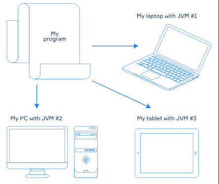
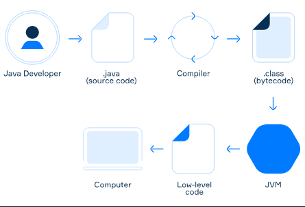

# Write, compile, and run

Even if you are not an experienced programmer, you have probably heard something about Java. It is
not only a programming language but also a widely used software platform. In this topic, you will 
get some essential ideas about the Java platform and learn how to write and run your programs in
Java environment.

## Writing a program
As a developer, the first thing you do while creating a program is writing the source code in a plain text file and saving it with an extension corresponding to the programming language you've chosen (.java for the Java language, .kt for Kotlin, and so on). A single program consists of one or more such files, which contain instructions specifying what the program does. The source code must follow the syntax rules of the respective language and be easy to read and understand.

## Compilation
After the code is written, you need to make the computer run the program. As computers don't understand
the source code, it needs to be translated into a computer-comprehensible format. That's where a 
special program called a compiler comes in handy. The code obtained after compilation is called
native code or low-level code. Each computer platform uses different low-level commands, just like
people around the world speak different languages. It creates an additional challenge to use a program
on different devices.

In the world of Java, a compiler (the javac tool for Java or the kotlinc tool for Kotlin) translates
source code into an intermediate representation known as Java bytecode stored in files with a .class 
extension. Computers can't read bytecode without translation, but a system called the Java Virtual
Machine (JVM) can execute it.

## Running a program
The Java Virtual Machine is an application that represents a virtual computer according to the JVM 
specification document. It executes the compiled Java bytecode and translates it into low-level 
commands, which the computer understands. Each platform has its own version of the JVM, but since 
all JVMs match the same specification, your program will behave identically on different devices.

One of the main concepts of the Java Platform is "write once, run anywhere". It means that a program
can run on various devices as long as they have a JVM installed. This concept is also frequently 
called platform independence or portability.

It's important to remember: the code input into the JVM is platform-independent, while the output code
is platform-dependent.

If the JVM is installed on the computer, you can run a compiled JVM program using the java tool.
It will open a file with the .class extension to launch the program from this file. The tool is 
the same for all JVM languages.

The picture below briefly summarizes the work cycle of a JVM program.

## JVM languages
The Java Platform allows using more than one programming language to create programs. This is 
achieved by the design of the JVM: it doesn't know anything about any particular programming language.
It only understands Java bytecode. If the tools for a programming language can generate bytecode,
programs written in this language can be executed on the JVM. Such languages are often called JVM 
languages. They include Java itself, Kotlin, Scala, Groovy, Clojure, and others. So, to create 
programs in the world of Java, you can choose the most convenient language of your choice.

Nowadays, you can find tools to generate Java bytecode for almost any programming language, which 
means that there's hardly any language that is not a JVM language.

## Conclusion
- Developers write program source code in text files with appropriate extensions.
- Compilers translate source code into Java bytecode stored in .class files.
- The Java Virtual Machine executes bytecode, giving low-level commands to the computer.
- All JVMs are defined by the JVM specification, thus providing platform independence for programs.
