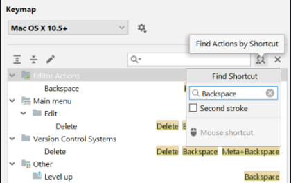

# IntelliJ IDEA Basics

The main goal of IntelliJ IDEA is to raise your productivity while you are writing code. We prepared some basic advice to level up the speed and comfort of your developing experience. Those are for common cases, but you can also find more on the IntelliJ IDEA webpage.

Use keyboard shortcuts
We encourage you to use keyboard shortcuts, because they can significantly speed up your coding and even reduce the risks of Repetitive Strain Injury. IntelliJ IDEA is a keyboard-centric IDE. You can choose one of the pre-configured shortcut schemes, or a keymap, in File | Settings | Keymap:

You can always take a closer look at the list of actions and corresponding shortcuts available via search:

Or, you can search for action by shortcut:

You can also set up your own keymap if you need a customizable list of shortcuts.

Note: If you use the default keymap of your OS and want a nice-looking cheat sheet to print out, go to Help | Keyboard Shortcuts PDF.

Go to the dark side
IntelliJ IDEA initially uses the default light color scheme, but you can always switch to the dark Darcula scheme. You can switch to it in File | Settings | Appearance & Behavior | Appearance by choosing Darcula under the Theme dropdown list:

Note: you can use ? ` (in macOS) or Ctrl + ` (in Windows and Linux) to switch quickly between color schemes and keymaps.

Local Terminal
IntelliJ IDEA features a local terminal that makes it possible to access the command line. Depending on your platform, you can work with the command prompt, PowerShell, Bash, etc. Using the terminal, you can execute any command without leaving the IDE.

To run the console, press ? F12 / Alt + F12 or click the Terminal tool window button:

Conclusion
IntelliJ IDEA allows you to:

choose the scheme of keyboard shortcuts in File | Settings | Keymap and take a look for the shortcut you need by searching

change the theme in File | Settings | Appearance & Behavior | Appearance

open the terminal by ? F12 / Alt + F12 or press the Terminal window button

Now you have a solid background on how to use common IntelliJ features. It is time to put them into practice!
