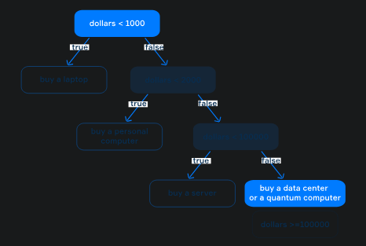

# Conditional statement
The *conditional statement* is a construction that allows a program to perform different
*computations* depending on the value of a *Boolean* expression. If it is <mark>true</mark>, the
program performs one computation; otherwise, if it is <mark>false</mark>, the program performs 
another computation. Here are some examples of Boolean expressions: <mark>a > b, i - j == 1</mark>,
and so on.

The conditional statement has different forms. We will use all of them.

## The single if-case
The simplest form of the conditional statement consists of the keyword <mark>if</mark>, a Boolean
*expression* enclosed in parentheses, and a body enclosed in *curly braces*.
```
if (expression) {
// body: do something
}
```
If the expression is <mark>true</mark>, the statements inside the code block are executed;
otherwise, the program skips them.

See the following example.
```
int age = ...; // it has a value
if (age > 100) {
System.out.println("Very experienced person");
}
```
In this example, if the <mark>age</mark> is greater than 100 the code prints **"Very experienced
person"**, otherwise, it does nothing.

Sometimes you will see a situation where the expression in a condition is a single <mark>boolean</mark>
type variable. Instead of writing <mark>b == true</mark> or <mark>b == false</mark>, use this
variable (or its negation with <mark>!</mark>) as the Boolean expression:
```
boolean b = ...; // it is true or false
if (b) { // or !b
// do something
}
```
A conditional statement can be used in any place in a program where the statement is expected.
It can even be nested inside another conditional statement to perform multistage checks.

## The if-else-cases
The if-case above can be extended with the keyword <mark>else</mark> and another body to do
alternative actions when the expression is <mark>false</mark>.
```
if (expression) {    
// do something
} else {
// do something else
}
```
In this case, if the expression is <mark>true</mark>, then the first code block is executed;
otherwise, the second code block is executed, but not both together.

In the example below, the program outputs different text depending on the value of <mark>num</mark>
(even or odd).

> Note: a number is even if it can be divided exactly by 2; otherwise it's odd.
```
int num = ...; // the num is initialized by some value

if (num % 2 == 0) {
System.out.println("It's an even number");
} else {    
System.out.println("It's an odd number");
}
```
Since a number can only be even or odd, only one message will be displayed. If <mark>num</mark>
is 10, the program outputs <mark>"It's an even number"</mark>. If the value is 11, it outputs
<mark>"It's an odd number"</mark>.

## The if-else-if-cases
The most general form of the conditional statement consists of several conditions and
<mark>else-if</mark>-branches.
```
if (expression0) {
// do something
} else if (expression1) {
// do something else 1
// ...
} else if (expressionN) {
// do something else N
}
```
The following code outputs recommendations about what computer you need to buy depending 
on your budget.
```
long dollars = ...; // your budget

if (dollars < 1000) {
System.out.println("Buy a laptop");
} else if (dollars < 2000) {
System.out.println("Buy a personal computer");
} else if (dollars < 100_000) {
System.out.println("Buy a server");
} else {
System.out.println("Buy a data center or a quantum computer");
}
```
This conditional statement has four branches: <mark>dollars < 1000</mark>, <mark>dollars < 2000</mark>,
<mark>dollars < 100_000</mark> and <mark>dollars >= 100_000</mark>. For example, if the value of
<mark>dollars</mark> is <mark>10_000</mark>, it prints <mark>"Buy a server"</mark> because
<mark>10_000</mark> is more than <mark>2000</mark> , which means that the first and the second
conditions are false, and less than <mark>100_000</mark> , which means that the third condition
is true.

A conditional statement with multiple branches creates a *decision tree*, whose nodes consist of
boolean expressions, and each branch is marked with true or false. The true-branch leads to a
block of statements to be executed and a false-branch leads to the next condition to be checked.
The last false-branch means "in all other cases".

> When talking about conditions, programmers often use the term "control flow statements".
> Control flow is the order in which various parts of a program are executed. You will probably
> meet this term in our topics and on other external resources.

The picture below demonstrates such a tree for the example with computers.



This example completes our examination of conditional statements.
