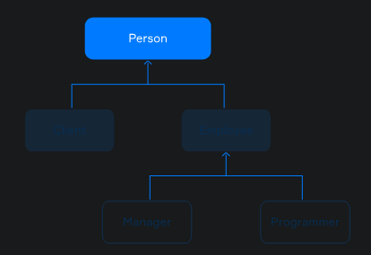

# Inheritance

Inheritance is a mechanism for deriving a new class from another class (base class). The new class 
acquires some fields and methods of the base class. Inheritance is one of the main principles of
object-oriented programming. It allows developers to build convenient class hierarchies and reuse 
existing code.

## Extending classes
When it comes to inheritance, there are several terms. A class derived from another class is called
a subclass (it's also known as a derived class, extended class or child class). The class from
which the subclass is derived is called a superclass (also a base class or a parent class).

To derive a new class from another, the keyword extends is used. The common syntax is shown below.
```
class SuperClass { }

class SubClassA extends SuperClass { }

class SubClassB extends SuperClass { }

class SubClassC extends SubClassA { }
```

There are important points about inheritance in Java:
- Java doesn't support multiple-class inheritance, meaning that a class can only inherit from a single
superclass;
- a class hierarchy can have multiple levels (class C can extend class B that extends class A);
- a superclass can have more than one subclass.

A subclass inherits all public and protected fields and methods from the superclass. A subclass can 
also add new fields and methods. The inherited and added members will be used in the same way.

A subclass doesn't inherit private fields and methods from the superclass. However, if the superclass 
has public or protected methods for accessing its private fields, these members can be used inside 
subclasses.

Constructors are not inherited, but the superclass's constructor can be invoked from the subclass 
using the special keyword super. This keyword is discussed in more detail in another topic.

If you'd like the base class members to be accessible from all subclasses but not from the outside 
code (excluding the same package), use the access modifier protected.

Inheritance represents the IS-A relationship. A base class represents the general and a subclass 
represents the particular or specific.

## An example of a class hierarchy
Let's consider a more graphic example. A telecommunication company serves clients. It has a small 
staff consisting only of managers and programmers. Let's consider a class hierarchy for people 
associated with the company's activities (including clients).

At first, we present the hierarchy as a figure. An arrow indicates that one class extends another
one.



- the base class Person has fields for storing common data: name, year of birth, and address;
- the class Client has additional fields to store the contract number and status (gold or not);
- the class Employee stores the start date of work for the company and the salary;
- the class Programmer has an array of the programming languages a programmer uses;
- the class Manager may have a dazzling smile.

Let's see the code:
```
class Person {
protected String name;
protected int yearOfBirth;
protected String address;

    // public getters and setters for all fields here
}

class Client extends Person {
protected String contractNumber;
protected boolean gold;

    // public getters and setters for all fields here
}

class Employee extends Person {
protected Date startDate;
protected Long salary;

    // public getters and setters for all fields here
}

class Programmer extends Employee {
protected String[] programmingLanguages;

    public String[] getProgrammingLanguages() {
        return programmingLanguages;
    }

    public void setProgrammingLanguages(String[] programmingLanguages) {
        this.programmingLanguages = programmingLanguages;
    }
}

class Manager extends Employee {
protected boolean smile;

    public boolean isSmile() {
        return smile;
    }

    public void setSmile(boolean smile) {
        this.smile = smile;
    }
}
```
This hierarchy has two levels and five classes overall. All fields are protected , which means they
are visible to subclasses. Each class also has public getters and setters, but some are skipped in
the code as these classes use the default no-argument constructor.

Let's create an object of the Programmer class and fill the inherited fields using the inherited
setters. To read the values of the fields, we can use inherited getters.
```
Programmer p = new Programmer();

p.setName("John Elephant");
p.setYearOfBirth(1985);
p.setAddress("Some street, 15");
p.setStartDate(new Date());
p.setSalary(500_000L);
p.setProgrammingLanguages(new String[] { "Java", "Scala", "Kotlin" });

System.out.println(p.getName()); // John Elephant
System.out.println(p.getSalary()); // 500000
System.out.println(Arrays.toString(p.getProgrammingLanguages())); // [Java, Scala, Kotlin]
```
We also can create an instance of any class included in the considered hierarchy.

So, inheritance provides a powerful mechanism for code reuse and writing convenient hierarchies. 
Many things in the real world can be simulated, like hierarchies from a more general to a more 
particular concept.

## Final classes
If a class is declared with the keyword final, it cannot have subclasses at all.
```
final class SuperClass { }
```
If you try to extend the class, a compile-time error will occur.

Some standard classes are declared as final: Integer, Long, String, Math. They cannot be extended from.

## Conclusion
Inheritance allows you to build class hierarchies where subclasses (children) take some fields and 
methods of the superclass (parent). Such a hierarchy can have multiple levels, but every class can
inherit only from a single superclass. A good class hierarchy helps to avoid code duplication and
makes your program more modular. If a class should not have subclasses, it should be marked as final.


