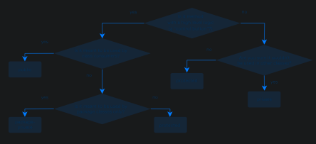
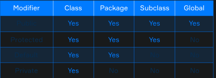

# Access Modifiers

You've probably seen the following piece of code:
```
public static void main(String[] args) {
    // some code goes here
}
```
Ever wondered why the word "public" is used? It means that the main(...) method is available to 
everyone. The word public is an access modifier, a special keyword that specifies who is allowed 
to use your code or a part of it. It can be placed in front of any field, method, or class.

So, you already know at least one of the access modifiers! The others are: package-private, protected, 
and private. Why do we need them? Let's find out.

OK, so why should I use them?
There are two main reasons to take access under control: clarity and safety of code.

Code clarity. Imagine your code is an engine of a washing machine with functions such as choosing a
washing program or starting a washing process. How can we help the user figure out how to wash their
clothes? We can cover the engine with the body and add buttons for choosing a washing mode and 
starting the process. The user doesn't need to know what is going on inside the machine?s body; 
the buttons to get the result are more than enough.

That's how access control helps in code ? you can hide the engine from the user by restricting 
access and simply providing them with the public buttons.

Code safety. Now imagine you have developed a rather useful library that is used by other developers.
One day Jane Doe wants to use your code?s functionality in her project, but the problem is that she
needs to change one variable in one of your classes. If it is public, nothing can stop her from doing
that in her code before using method A from the library.

What can happen if the variable is used somewhere in method B? The B method would probably start to
act unpredictably. So, protecting important parts of your code is a guarantee that it will be used 
as an unmodifiable part and its behavior will be the exact one you have developed it for.

## Public and package-private classes
When you manage the access in your code, you divide objects of your program into two groups:
top-level and low-level items. Fields and methods that are explicitly used outside the class are 
called top-level fields and methods. If fields and methods are used inside the class, they are known
as low-level ones. This low-level and top-level logic is also applicable to classes.

Usually, using low-level items helps to unload top-level classes, methods, or fields to structure 
and decompose the code. If these items are not explicitly used, it will be efficient to restrict 
access to them.

Now let?s see how we can set restrictions to different parts of the code: a top-level class can
have one of two following modifiers:
- package-private (default, no explicit modifier): visible only for classes from the same package;
- public: visible to all classes everywhere.

Here is a class inside the package org.hyperskill.java.packages.theory.p1. with default 
package-private access:
```
package org.hyperskill.java.packages.theory.p1;

class PackagePrivateClass{

}
```
This class can be used only by other classes from the same package. It's not even visible for
classes from any other package:
- org.hyperskill
- org.hyperskill.java.packages.theory
- default package

Note the first two examples ? if the class is package-private in package a.b, it is still unavailable 
from package a.c and package a itself.

Here is a public class inside the package org.hyperskill.java.packages.theory.p2
```
package org.hyperskill.java.packages.theory.p2;

public class PublicClass {

}
```
This class has no access restrictions, it is visible to all classes and can be used everywhere:
- org.hyperskill
- org.hyperskill.java.packages.theory
- org.hyperskill.java.packages.theory.p1
- default package

The common way of using top-level class modifiers is:
- make the classes containing methods for users (the ?buttons?) public;
- make all other classes with low-level logic methods used by public ones package-private
(cover the engine with the body).

Remember: everything that?s not meant to be used/changed by classes from other packages should not
be public.

## Private members
A class member (a field or a method, e.g. class constructor) has more options to choose from: 
private, package-private, protected, and public. Let's consider member modifiers in more detail.

Fields are often declared private to control access to them from any other class. In some cases,
these fields are only used internally in the class and there is no way to change or even access 
them from any other class. In other cases, it can be done via accessor methods
(e.g. getters and setters). Getter and setter methods are used to protect and hide your data when
creating classes. A getter method returns the value of a field, while a setter method sets or 
updates the value. We will discuss the main features of getter and setter methods in further topics.

Private methods are used to hide the internal low-level logic implementation from the rest of the 
code and make public methods more brief and readable.

Here is the class Counter with the private field current. This field can be read with the method 
getCurrent() , a getter method, and changed with the inc() method. The last one is not exactly
a setter method because it doesn't manually set a value to a current variable, but just increments
it.
```
public class Counter {
    private long current = 0;
    
    public long getCurrent() {
        return this.current;
    }
    
    
    public void inc() {
        inc(1L);
    }
    
    
    private void inc(long val) {
        this.current += val;
    }
}
```
Sometimes, a private class constructor is required. This type of constructor can only be used inside 
the class, e.g. from another constructor, which can be public or private, or from the class methods.

## Package-private members
A package-private access modifier does not require any keyword. If a field, a method, or a constructor
has this modifier, then it can be read or changed from any class inside the same package.

Let's see an example: here are two classes in the same package: Salary and Promotion.

The class Salary has a package-private field and a constructor. An instance of the Salary class can 
be created inside a Promotion class, and the field can also be accessed by Promotion and its 
members because they belong to the same package.
```
public class Salary {
long income;

    Salary(long income) {
        this.income = income;
    }
}

public class Promotion {
Salary salary;

    Promotion(Salary salary) {
        this.salary = salary;
    }

    public void promote() {
        salary.income += 1500;
    }
}
```

## Protected and public members
Disclaimer: you will learn to use these two modifiers later!

A protected access modifier means that a class member can be accessed from classes inside the same 
package and all subclasses of this class. For now, it is important to remember that the protected 
option is less restricting than package-private.

A public access modifier means that there is no restriction on using a field, method, or class.
It's often used for constructors, and methods representing the class API but not commonly used 
with fields.

Here are common ways to understand which access modifier to choose. It is not the ultimate algorithm,
but it can help you understand the main use cases of the modifiers.



Let's review the names of access modifiers (from most to least limiting):
- private : available only inside a class;
- package-private (also known as default, implicit) : available for all classes in the same package;
- protected : available for classes in the same package and for subclasses (will be covered later);
 -public : available for all classes everywhere.



The table illustrates the level of access provided by the access modifiers: the class always has 
access to its members, and so on. Note that by a subclass here, we mean only a subclass of this
class used in another package.

Remember that only public or default (no keywords) modifiers may be used when declaring non-nested
classes. All four of them can be applied to class members: fields, methods, etc.

## Conclusion
In this topic, you learned about access modifiers that allow you to determine who will be able to
use the code. Using them makes your code safer and clearer. In conclusion, here is a piece of 
advice: use the most restrictive access level that makes sense for a particular member. Don't make 
all members public.
