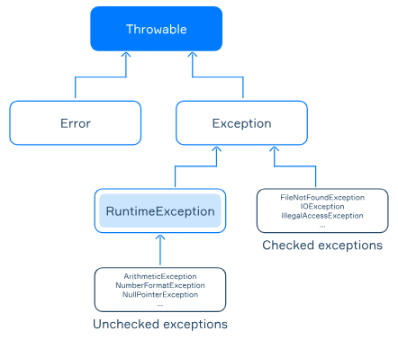

# Hierarchy of exceptions

Java is primarily an object-oriented language. In such a paradigm, all exceptions are considered 
objects of special classes organized into a class hierarchy. Understanding this hierarchy is 
essential both for job interviews and daily programming practice.

## Hierarchy of exceptions
The following picture illustrates the simplified hierarchy of exceptions:



The base class for all exceptions is java.lang.Throwable. This class provides a set of common 
methods for all exceptions:
- String getMessage() returns the detailed string message of this exception object;
- Throwable getCause() returns the cause of this exception or null if the cause is nonexistent or 
unknown;
- printStackTrace() prints the stack trace on the standard error stream.

We will return to the methods and constructors of this class in the following topics.

The Throwable class has two direct subclasses: java.lang.Error and java.lang.Exception.
- subclasses of the Error class represent low-level exceptions in the JVM, for example:
OutOfMemoryError, StackOverflowError;
- subclasses of the Exception class deal with exceptional events inside applications, 
such as: RuntimeException, IOException;

the RuntimeException class is a rather special subclass of Exception. It represents so-called 
unchecked exceptions, including: ArithmeticException, NumberFormatException, NullPointerException.

While developing an application, you normally will process objects of the Exception class and its 
subclasses. We won't discuss Error and its subclasses here.

The four basic classes of exceptions (Throwable, Exception, RuntimeException and Error) are located 
in the java.lang package. They do not need to be imported. Yet their subclasses might be placed 
in different packages.

## Checked and unchecked exceptions
All exceptions can be divided into two groups: checked and unchecked. They are functionally equivalent 
but there is a difference from the compiler's point of view.

1. Checked exceptions are represented by the Exception class, excluding the RuntimeException subclass.
The compiler checks whether the programmer expects the occurrence of such exceptions in a program 
or not.

If a method throws a checked exception, this must be marked in the declaration using the special 
throws keyword. Otherwise, the program will not compile.

Let's take a look at the example. We use the Scanner class, which you are already familiar with,
as a means to read from standard input, to read from a file:
```
public static String readLineFromFile() throws FileNotFoundException {
    Scanner scanner = new Scanner(new File("file.txt")); // throws java.io.FileNotFoundException
    return scanner.nextLine();
}
```

FileNotFoundException is a standard checked exception. This constructor of Scanner declares that
it may throw the FileNotFoundException exception if the specified file does not exist. To ensure 
that this method can be compiled successfully, we must include the throws keyword in the method 
declaration to indicate that the method may throw the FileNotFoundException exception. As a result, 
the caller of this method will need to decide whether to either handle the exception internally or
throw it further to its caller method.

2. Unchecked exceptions are represented by the RuntimeException class and all its subclasses. 
The compiler does not check whether the programmer expects the occurrence of such exceptions in 
a program.

Here is a method that throws a NumberFormatException when the input string has an invalid format
(e.g., "abc").
```
public static Long convertStringToLong(String str) {
    return Long.parseLong(str); // It may throw a NumberFormatException
}
```
This code always successfully compiles without the throws keyword in the declaration.

Runtime exceptions may occur anywhere in a program. The compiler doesn't require that you specify 
runtime exceptions in declarations. Adding them to each method's declaration would reduce the 
clarity of a program.

The Error class and its subclasses are also considered as unchecked exceptions. However, they form
a separate class.

## Conclusion
All exceptions are represented by the Throwable class, which has two subclasses: Exception and Error.
There are also two types of exceptions: checked and unchecked.

Unchecked exceptions are not validated by the compiler, so you don't have to handle them. They are
represented by the RuntimeException subclass of the Exception class. Errors from the Error class 
are also considered unchecked.

Checked exceptions have to be handled and indicated explicitly. They are located in all the other
subclasses of Exception.
