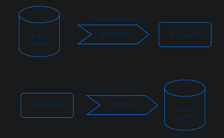

# What are streams?

Sometimes your program should process data located outside it or save results to an external destination. Java provides an abstraction called stream that unifies work with disks, files, network locations and other resources.

Input and output streams
In some sense, a Java stream is similar to a real-world water stream which has a beginning (source) and an end (destination). Based on the same principles, IO streams can be categorized into two groups:

input streams, which read data from a source;
output streams, which write data to a specified destination.
The picture below demonstrates it.

In fact, you've already known two specific examples of IO streams: System.in and System.out. We used them to read/write data from/to the console before.

Byte and char streams
Streams can be further classified into two categories based on how they represent sequences of data:

byte streams that are used to read and write data in bytes;
char streams that are used to read and write data in characters according to the 16-bit Unicode format.
Char streams make processing text data much easier for programmers. In comparison with them, byte streams are quite low-level but can work with data of any type including multimedia.

Buffered streams
Some streams use a temporary memory location. At first, such streams read or write data to a temporary location, and then data is moved on to a source or destination from it. This temporary location is typically a byte or character array called a buffer, and the whole process is called buffering. The reason why an intermediate memory location is introduced is that appealing to some sources or destinations takes a substantial time interval. So buffering is a kind of optimization that minimizes the number of interactions with them.

Let's see how buffering works in output streams. When you write data to the stream, it is first accumulated in a buffer. Once the buffer is full, the whole stored data is written to the destination.

Some input streams also have a buffering feature. When a stream reads data for the first time, it reads as much as a buffer can hold. Even if only a few bytes or characters were requested, the buffered input stream will read bytes until the buffer is full. The next reading first checks if there is any unread data in the buffer. In case the buffer contains some unread data, the stream takes it from the buffer and does not have to interact with the source. Otherwise, it requests data from the source like the first time.

Now let?s do a few exercises and have a look at streams in detail.
