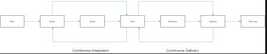

# Introduction to CI/CD

You're working on a new feature for your application. How can you ensure that the feature will not cause a malfunction? And in case it does, how can you revert to the previous version of this application?

It may seem an easy task if you work alone. What if you're a part of a bigger team? Yes, it will be a daunting and cumbersome task. Some developers might use a different library version or a different operating system where the application works for them but doesn't work for others. To avoid it, Continuous Integration/Continuous Delivery systems, or CI/CD, step in.

What is CI/CD?
The word "continuous" in CI/CD means that everybody on the team commits their code to the single mainline multiple times a day. The "integration" means that before committing, you need to merge with the mainline and make sure everything works fine. The changes done by a developer when the code is committed are tested using an automated process. It creates a build using the submitted code and runs automated tests against the new build. This automation allows developers to routinely release commits without worrying about potential application-breaking code. The automated tests will certainly catch it.

Generally, the following steps happen in CI:

Lint ? to verify the code style;

Build ? to build the application with the feature;

Test ? to ensure you don't break the existing features.

With a proper functioning CI, your code is always merged to the main branch by the pipeline without any human intervention.

The testing is only effective when the tests made by the developer have enough code coverage to isolate the bugs!

A strategy when all the changes are automatically deployed to production after CI is called delivery. It facilitates the entire application release process. Continuous delivery is the approach for teams to produce software in short cycles, ensuring that each build is always error-free.

Generally, the following steps happen in CD:

Test ? to ensure you don't break the existing features;

Release ? to put it all together in an easily movable batch;

Deployment ? to make it available to the world.

In CD, the production deployment can either be approved by a person or automatically without explicit approval. The latter is known as Continuous Deployment.

There are other continuous processes:

Continuous documentation: the practice of incrementally developing and updating documentation as part of the development cycle to keep it in sync with the codebase;

Continuous benchmarking streamlines continuous improvement by focusing on what is happening in the code;

Continuous testing allows any change made in the code to be tested immediately.

CI/CD automates parts of your project that would otherwise have to be done manually. It finds small issues before they sneak into the main codebase. If your team pushes the bad code out to your customers, you'll end up having a bad week. It also helps prevent something that is called technical debt. The main code repositories are updated over time, so one shortcut fix is always better than an exponentially more expensive fix years later because that fix would be so deeply intertwined into all codebases and logic.

Benefits of CI/CD
Continuous integration, delivery, and deployment (CI/CD) have enabled many organizations to release their products on a more frequent basis without compromising on quality. The CI/CD pipeline includes several tools and frameworks to assist developers, testers, and other project participants in delivering software to end users. It increases the overall efficiency of the software delivery process by giving teams more room. Here are some benefits of how CI/CD helps a team of developers:

CI/CD decreases the deployment time, the speed at which a DevOps team can deliver a functional application to end-users;

Reduction of delivery risk, as you no longer need specialists to ensure the code quality. CI/CD pipeline keeps the code quality in line;

Changes can be tracked; fast automated feedback is always available;

CI/CD pipeline can isolate errors making it error-free;

Easier to rollback, as you can return to the previous code version if any problem occurs.

Popular CI/CD environments
There are a lot of CI/CD solutions, so let's look at the most popular ones:

Jenkins ? is a self-hosted setup. It is an open-source CI server for automating the build and testing processes. It is very flexible as it provides numerous plugins across multiple platforms to improve performance.

Team City ? is very robust as it provides real-time reporting when a test fails. It also pinpoints the exact commits that caused the test to fail.

GitHub Actions ? is a cloud-based setup. It enables us to automate our workflows easily. You can directly build, test, and deploy the code right from GitHub. It also makes it easier to carry out code reviews and manage branches.

GitLab ? is simple to set up as a self-hosted GitHub alternative. It has better documentation and is much easier to use with containerized builds.

Conclusion
CI/CD deals with how software is continuously written, integrated, analyzed, and deployed to customers. CI/CD helps test new code to ensure seamless logic and format of the code. It also assists with fulfilling the scope of the project. CI/CD means faster speed in the marketplace and higher quality code, limiting the fears of technical debt.
