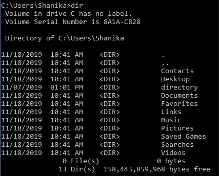

# Command line overview

While working on the computer, you need to communicate with the Operating system (OS) to get things
done for you. For example, if you want to open a file, you have to tell the Operating system (Windows,
Linux, or macOS) about it. There are two ways of interacting with the OS: one is text-based, the
other is visual based. Both are important. These two methods are the command-line interface and the
graphical user interface.

## What is the command line?
The command-line interface or CLI is a way to interact with an OS via text commands. On the other
hand, the graphical user interface or GUI provides an interface with many icons and menus. Here,
you give commands to the operating system by clicking on these icons or menu items.

In the past, command-line interfaces were the only means of interacting with a computer. But why use
it now, when you have a simple, familiar graphical interface? Well, generally command-line interfaces
are much more flexible and have more options. For example, you can combine commands to create a new
one, while you cannot do that via a graphical interface. Some software can even have only a
command-line interface, thus requiring its user to know command line basics.

Besides, programs executable by the command-line interface can be written in a command language. 
They are called shell scripts on UNIX and UNIX-like systems such as GNU/Linux and macOS, and batch
files on Windows.

All operating systems have command-line interfaces. Applications may have it as well. Also, modern
programming languages provide an interactive command-line mode, in which you execute code line by line.

## Accessing command-line interpreter
Usually, you don't have to go to the location of the command-line interpreter or terminal to open
it. You can open it by simply searching cmd in Windows and terminal in Linux distributions.

If you feel more like an explorer and want to find the location on your own, then try the following
paths:
- For Windows 10 or 8 at Start?Windows System?Command Prompt.
- For Windows 7, Vista or XP at Start?All Programs?Accessories?Command Prompt.
- For macOS at Applications?Utilities?Other?Terminal. Some Mac users prefer iTerm2, a replacement for
Terminal, because it is slightly more user-friendly. You can find the details on the iTerm official
website and install it on your computer.
- For Linux: it depends on your system, but usually, the CLI is located at
Applications?Accessories?Terminal or at Applications?System?Terminal. If you don't find it here,
- just google how to access the command line on your system.

When you open it, you'll see a black (or white) window. If everything is okay, you'll see the
command prompt where you'll be typing your command ? an indicator that your computer is ready to
accept commands. For Windows, the command prompt ends with >, while for Linux it's $, and for Mac
OS it's $. To execute a command, type it and then press Enter.

## Learning commands
It's time to learn some important commands. Let's open the command-line interpreter and type some
commands. When you open it, you will see something similar to the below text.
```
C:\Users\name>
```
It means that you are in this directory and you can work in the CLI. Now let's try to use it.

Imagine you just woke up on the floor in a room unfamiliar to you. In fact, everything is unfamiliar
to you, you don't remember anything, not even your name. There's only a computer with the open
terminal and this guide, so you decide that it might be helpful to figure something out. So, now
you will type your command next to this path.

First, type whoami and press Enter. Unfortunately, it won't provide you with a deep and satisfying
answer about who you really are, but you will see something like this:
```
desktop-qd7c3ju\shanika
```
Good, now you know your name, an imaginary one, at least. As you could already guess, the
whoami command just returns the username you used on your machine. That's why you see the above output.

Next, type dir if you use Windows or ls if you use Linux or macOS and press Enter. Both of these
commands return the list of non-hidden files and folders in your current directory. To show the list
including hidden files and folders, just add an option -a, which stands for all. The ls command is
one of the most widely used ones by developers, especially when they work on servers.

If you have Windows, you will see something similar to the image below.



There's no file that is helpful for your situation. Alas!

Isn't there a command to escape? Yes, there's one. Just type exit and you'll be out... of the
command-line interpreter because this command lets you exit it. Good news, you've just learned 
µsome useful commands and completed the quest, Shanika! Now you can be free.

On the SS64 website, you can find a complete list of commands for Windows, as well as for Linux and
macOS

## Conclusion
The important thing to know is that excellent GUIs haven't made the CLI obsolete. It is still one
of the quickest ways to get your job done. Especially if you are going to be a developer, it is
very important to have good knowledge of what commands are available to you.

In this topic, we introduced the command-line interface: what it is, where it can be found, and how
it can be used. We tried several commands as well: whoami, dir or ls, and exit. Later, we will learn
CLI commands in detail, but now let's practice for a while!
